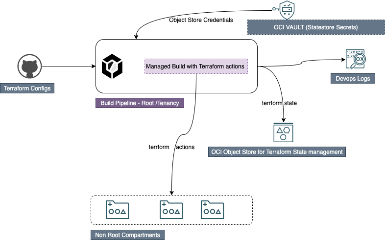

Manage OCI policies using a OCI Devops build pipeline and OCI Terraform.
------

### Objectives

- Manage policies and dynamic group and more using OCI Devops and Terraform.
- Deomonstrate how to execute terraform scripts from OCI Build runner.
- Manage Terraform state management using object storage.


*Target Audience* : OCI Intermediate and Experienced 

###  Flow 



### Procedure

- Its a specific sample with admin/root previledge ,so ensure that you are an admin to the tenancy or assigned with administrator previledges by the tenancy admin.

- Create an OCI Notification topic - https://docs.oracle.com/en-us/iaas/Content/Notification/home.htm 


- Create a dynamic group and add below rules.

```
ALL {resource.type = 'devopsbuildpipeline', resource.compartment.id = 'ocid1.compartment.oc1..xxx'}	
ALL {resource.type = 'devopsrepository', resource.compartment.id = 'ocid1.compartment.oc1..xxx'}

```

- Create a policy with below statements.


```
Allow dynamic-group "<DG Name>" to manage repos in c"<Compartment Name>"	
Allow dynamic-group "<DG Name>" to read secret-family in c"<Compartment Name>"	
Allow dynamic-group "<DG Name>" to manage devops-family in c"<Compartment Name>"	
Allow dynamic-group "<DG Name>" to manage generic-artifacts in c"<Compartment Name>"	
Allow dynamic-group "<DG Name>" to use ons-topics in c"<Compartment Name>"	
Allow dynamic-group "<DG Name>" to read secret-family in c"<Compartment Name>"
```

- Create a devops project - https://docs.oracle.com/en-us/iaas/Content/devops/using/create_project.htm#create_a_project 
- Associate it with the notification topic created.


- Enables logs for projects.


- Created a code repo - https://docs.oracle.com/en-us/iaas/Content/devops/using/create_repo.htm#create_repo


- Create a build pipeline - https://docs.oracle.com/en-us/iaas/Content/devops/using/create_buildpipeline.htm#create_buildpipeline


- Add a managed build stage to the build pipeline - https://docs.oracle.com/en-us/iaas/Content/devops/using/add_buildstage.htm


- Create an object storage bucket - https://docs.oracle.com/en-us/iaas/Content/Object/home.htm


- Create a customer secret keys for the user - https://docs.oracle.com/en-us/iaas/Content/Identity/Tasks/managingcredentials.htm#Working2


- Make a note of the Access key and Password info.


- Create an OCI Vault and create a master key - https://docs.oracle.com/en-us/iaas/Content/KeyManagement/home.htm


- Create two secretes and store customer secret keys and password.


- Now that we have all the infrastrecture and services are ready, let us do an implementation  . 
- Clone the repo to local machine or cloud -shell.
- Let us check the folder and file tree.


